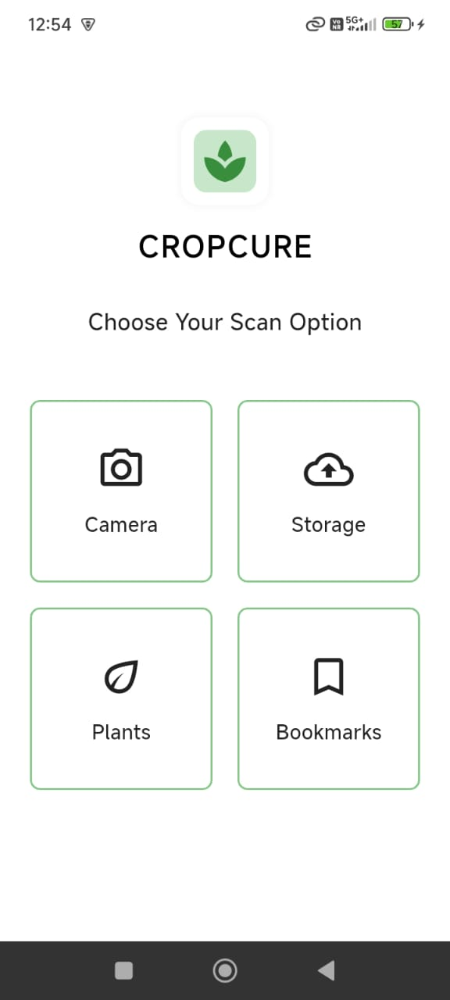
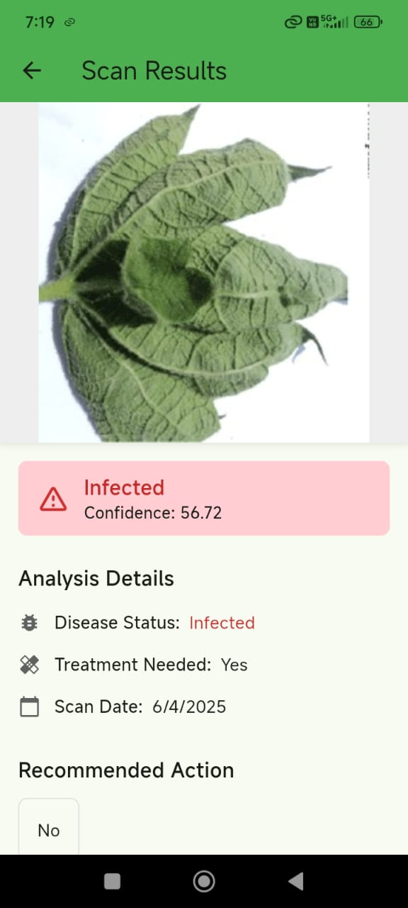

# 🌿 Crop Cure App

Crop Cure is an AI-powered Flutter application designed to assist farmers in detecting crop diseases through image-based analysis.

The app provides a simple and intuitive interface where users can scan plant leaves using a camera or upload images to get instant disease detection results along with actionable insights.

---

## 🚀 Features

* 📸 Scan crops using Camera or Storage
* 🌱 AI-based crop disease detection
* 📊 Confidence score for predictions
* ⚠️ Disease status (Infected / Healthy)
* 📋 Detailed analysis and recommendations
* 🔖 Bookmark and plant tracking options

---

## 🖥️ App Screenshots

### 🔹 User Interface



### 🔹 Detection Output



---

## 🛠 Tech Stack

* Flutter (Dart)
* Cross-platform support (Android, iOS, Web)
* Machine Learning integration (image classification model)

---

## 📂 Project Structure

```
Cropcure/
├── android/
├── assets/
├── ios/
├── lib/
├── linux/
├── macos/
├── test/
├── web/
├── windows/
├── pubspec.yaml
└── README.md
```

---

## ▶️ How to Run

1. Clone the repository

```
git clone https://github.com/YOUR-USERNAME/Cropcure.git
```

2. Navigate to the project

```
cd Cropcure
```

3. Install dependencies

```
flutter pub get
```

4. Run the app

```
flutter run
```

---

## 🎯 Purpose

This project demonstrates the application of mobile technology in agriculture for early detection of crop diseases and improving farming efficiency.

---

## 👤 Author

**Sharwil Bhende**

---

